<!-- BEN10-PROFILE:v3.4 -->

  <a href="https://www.linkedin.com/in/sangeet-sangwan-090196258/">
    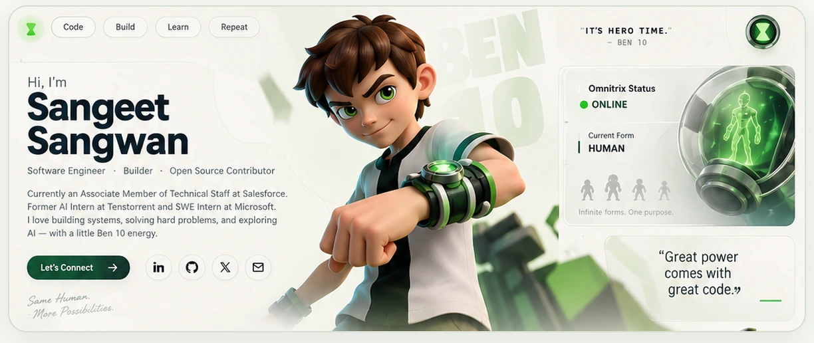
  </a>

<!-- Clickable Omnitrix navigation -->

  &nbsp;
  &nbsp;
  &nbsp;
  &nbsp;
  &nbsp;
  &nbsp;
  

<!-- First-party social identity badges -->

  &nbsp;
  &nbsp;
  

<!-- Responsive Omnitrix identity console -->

  <picture>
    <source media="(max-width: 680px)" srcset="./assets/omnitrix-status-mobile.svg" />
    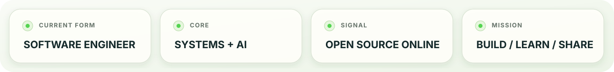
  </picture>

  

I'm **Sangeet Sangwan**, an Associate Member of Technical Staff at **Salesforce**, working across enterprise software, developer tooling, and systems that need to remain dependable at scale.

Previously, I was an **AI Intern at Tenstorrent** and a **Software Engineer Intern at Microsoft**. I studied Computer Science at **IIT Jammu**, where competitive programming, mentoring, and building technical communities became a major part of my journey.

I enjoy the engineering work that lives at the edges: reproducing subtle failures, writing focused regression tests, understanding performance trade-offs, and turning complicated behavior into maintainable code.

  

  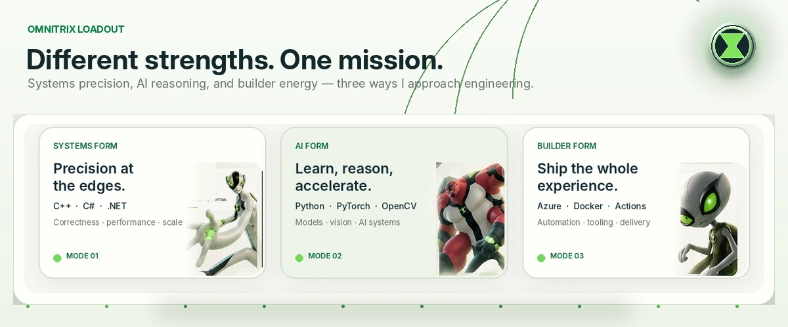

  

  <picture>
    <source media="(max-width: 680px)" srcset="./assets/tech-console-mobile.svg" />
    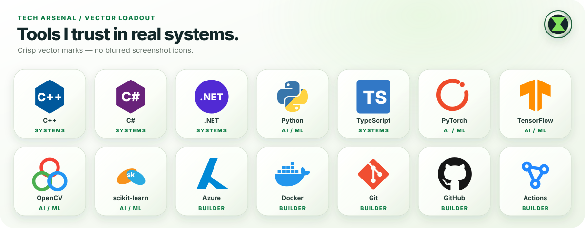
  </picture>

  

  <picture>
    <source media="(max-width: 680px)" srcset="./assets/experience-console-mobile.svg" />
    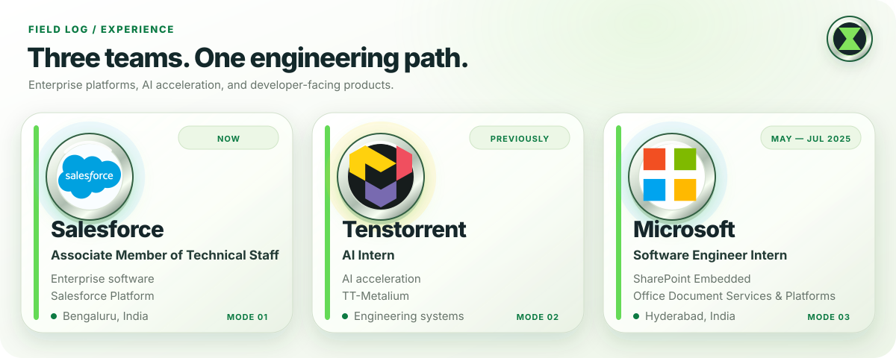
  </picture>

<strong>Experience in plain text</strong>

 

| Organization | Role | Focus | Location / period |
| :--- | :--- | :--- | :--- |
| **Salesforce** | Associate Member of Technical Staff | Software engineering · Salesforce Platform | Bengaluru, India · Current |
| **Tenstorrent** | AI Intern | AI engineering · high-performance acceleration · TT-Metalium | Previously |
| **Microsoft** | Software Engineer Intern | SharePoint Embedded · Office Document Services & Platforms | Hyderabad, India · May–July 2025 |

  

Public pull requests, grouped by the repositories where I contributed.

<!-- OSS-JOURNEY:START -->

  <picture>
    <source media="(max-width: 680px)" srcset="./assets/open-source-stats-mobile.svg" />
    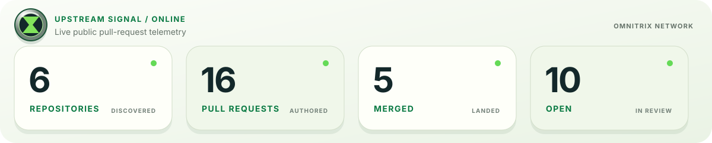
  </picture>

  <picture>
    <source media="(max-width: 680px)" srcset="./assets/open-source-map-mobile.svg" />
    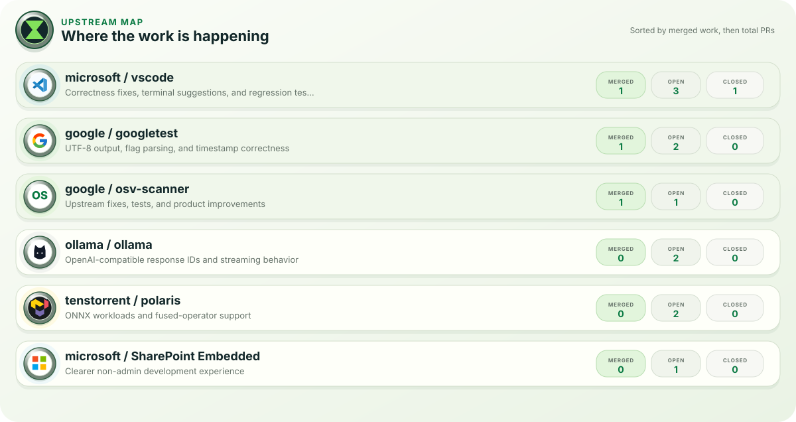
  </picture>

  <strong>5 repositories · 13 pull requests · 2 merged · 10 open · 1 closed without merge</strong> 
  <a href="https://github.com/search?q=is%3Apr%20author%3AMuszic%20is%3Apublic%20-user%3AMuszic&type=pullrequests"><strong>Explore every public upstream pull request ↗</strong></a>

<strong>Open exact repository counts and recent PR links</strong>

 

| Repository | My work | Merged | Open | Closed |
| :--- | :--- | ---: | ---: | ---: |
| [**microsoft/vscode**](https://github.com/microsoft/vscode) | Correctness fixes, terminal suggestions, and regression tests | [1](https://github.com/microsoft/vscode/pulls?q=is%3Apr%20author%3AMuszic%20is%3Amerged) | [3](https://github.com/microsoft/vscode/pulls?q=is%3Apr%20author%3AMuszic%20is%3Aopen) | [1](https://github.com/microsoft/vscode/pulls?q=is%3Apr%20author%3AMuszic%20is%3Aclosed%20is%3Aunmerged) |
| [**google/googletest**](https://github.com/google/googletest) | UTF-8 output, flag parsing, and timestamp correctness | [1](https://github.com/google/googletest/pulls?q=is%3Apr%20author%3AMuszic%20is%3Amerged) | [2](https://github.com/google/googletest/pulls?q=is%3Apr%20author%3AMuszic%20is%3Aopen) | 0 |
| [**ollama/ollama**](https://github.com/ollama/ollama) | OpenAI-compatible response IDs and streaming behavior | 0 | [2](https://github.com/ollama/ollama/pulls?q=is%3Apr%20author%3AMuszic%20is%3Aopen) | 0 |
| [**tenstorrent/polaris**](https://github.com/tenstorrent/polaris) | ONNX workloads and fused-operator support | 0 | [2](https://github.com/tenstorrent/polaris/pulls?q=is%3Apr%20author%3AMuszic%20is%3Aopen) | 0 |
| [**microsoft/SharePoint-Embedded-VS-Code-Extension**](https://github.com/microsoft/SharePoint-Embedded-VS-Code-Extension) | Clearer non-admin development experience | 0 | [1](https://github.com/microsoft/SharePoint-Embedded-VS-Code-Extension/pulls?q=is%3Apr%20author%3AMuszic%20is%3Aopen) | 0 |

#### Recent pull-request activity

| Pull request | Status |
| :--- | :--- |
| [microsoft/vscode#301176 · fix: correctly handle falsy values in HistoryNavigator._currentPosition](https://github.com/microsoft/vscode/pull/301176) | Open |
| [microsoft/vscode#305309 · feat(terminal-suggest): Add upstream Cargo completion spec](https://github.com/microsoft/vscode/pull/305309) | Open |
| [google/googletest#5082 · Preserve UTF-8 strings in JSON output](https://github.com/google/googletest/pull/5082) | **Merged** |
| [google/googletest#5090 · Fix JSON timestamps to use UTC](https://github.com/google/googletest/pull/5090) | Open |
| [tenstorrent/polaris#496 · Add deeepseek-coder workload ONNX Support](https://github.com/tenstorrent/polaris/pull/496) | Open |
| [tenstorrent/polaris#494 · Add Whisper base workload ONNX Support and SkipLayerNormalization support](https://github.com/tenstorrent/polaris/pull/494) | Open |
| [google/googletest#5087 · Reject empty values for integer flags](https://github.com/google/googletest/pull/5087) | Open |
| [microsoft/vscode#300808 · test: add findFiles2 multiple pattern and exclude coverage](https://github.com/microsoft/vscode/pull/300808) | Open |

Counts cover public PRs authored by me in repositories I do not own. Issues, reviews, direct commits, private work, and PRs to my own repositories are intentionally excluded.

<!-- OSS-JOURNEY:END -->

  

  <picture>
    <source media="(max-width: 680px)" srcset="./assets/selected-work-mobile.svg" />
    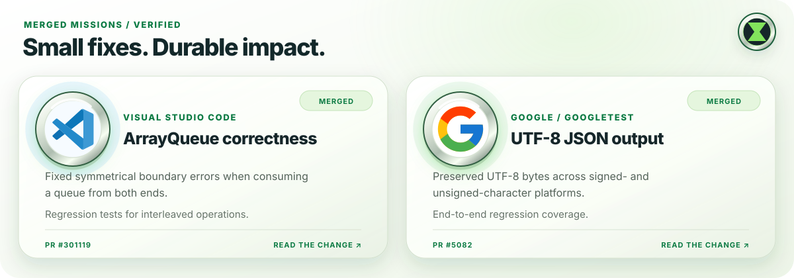
  </picture>

  <a href="https://github.com/microsoft/vscode/pull/301119"><strong>Read the VS Code fix ↗</strong></a>
  &nbsp;&nbsp;·&nbsp;&nbsp;
  <a href="https://github.com/google/googletest/pull/5082"><strong>Read the GoogleTest fix ↗</strong></a>

  

  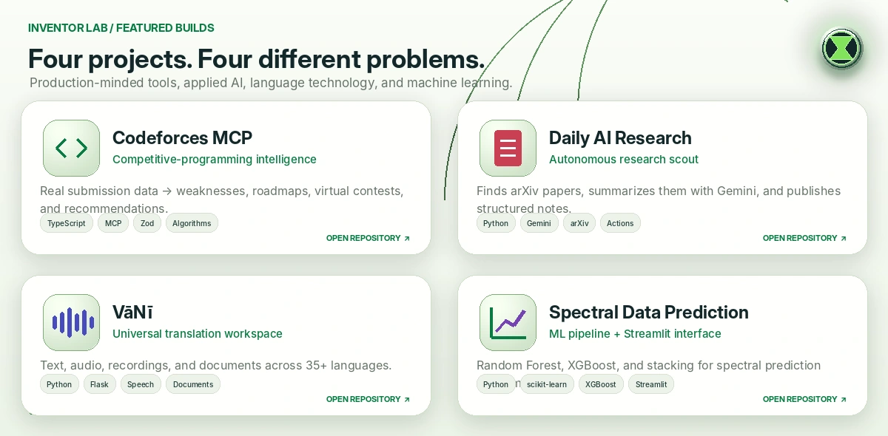

  <a href="https://github.com/Muszic/codeforces-mcp"><strong>Codeforces MCP ↗</strong></a>
  &nbsp;·&nbsp;
  <a href="https://github.com/Muszic/daily-research"><strong>Daily AI Research ↗</strong></a>
  &nbsp;·&nbsp;
  <a href="https://github.com/Muszic/Vani"><strong>VāNī ↗</strong></a>
  &nbsp;·&nbsp;
  <a href="https://github.com/Muszic/Spectral-Data-Prediction"><strong>Spectral Data Prediction ↗</strong></a>

  

  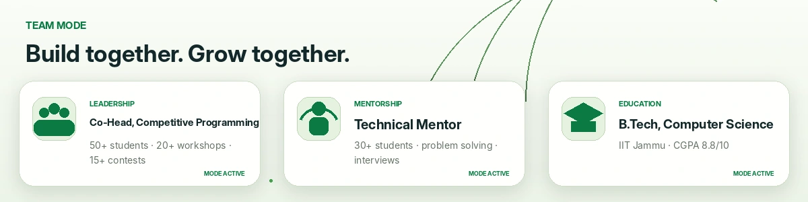

<strong>Leadership and education in plain text</strong>

 

| Role | Community | Impact |
| :--- | :--- | :--- |
| **Co-Head, Competitive Programming** | IIT Jammu · 50+ students | Led 20+ workshops and 15+ contests |
| **Technical Mentor** | IIT Jammu coding community · 30+ students | Mentored students in problem solving and interview preparation |

**Education:** B.Tech in Computer Science, **IIT Jammu** · CGPA: **8.8/10**.

  

  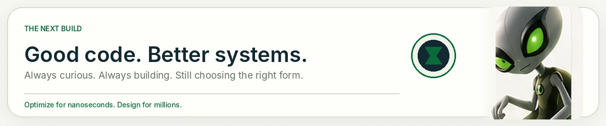

  <a href="https://www.linkedin.com/in/sangeet-sangwan-090196258/"><strong>LinkedIn</strong></a>
  &nbsp;·&nbsp;
  <a href="https://github.com/Muszic"><strong>GitHub</strong></a>
  &nbsp;·&nbsp;
  <a href="https://leetcode.com/u/muszic/"><strong>LeetCode</strong></a>

  Optimize for nanoseconds. Design for millions. 
  Fan-inspired profile artwork. Not affiliated with Cartoon Network or Warner Bros. Discovery.

